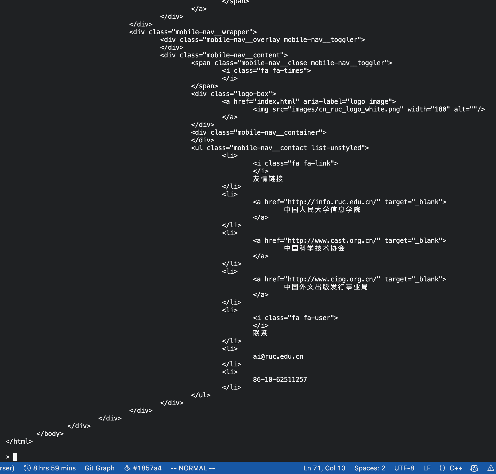

# CSS 选择器 实验报告
- 最后修改：2023.11.30
## 1.需求分析

### 任务描述

本程序旨在实现一个 HTML 解析和选择器工具，其主要任务是解析 HTML 文档，提供对 HTML 元素的查询和操作功能，同时支持 CSS 选择器的使用。程序的关键功能包括 HTML 文档的解析、元素的查找和属性的处理。

#### 输入

1. **HTML 文档**：作为主要输入，可以是一个 HTML 文件或一个字符串形式的 HTML 文档。同时也可以使用 url 输入，自动从网上爬取网页。
2. **选择器查询**：支持 CSS 选择器语法，用于在 HTML 文档中查找元素。
3. **文件路径**：当输入是文件时，提供文件的路径。

##### 输入值范围

- HTML 文档应遵循标准的 HTML 格式。
- CSS 选择器查询支持常见的选择器类型，如标签、类、ID 和属性选择器。暂不支持伪类。
- 文件路径应为有效路径，指向可访问的 HTML 文件。

#### 输出

1. **查询结果**：根据 CSS 选择器查询返回的 HTML 元素链表。
2. **解析后的 HTML 结构**：展示解析后的 HTML 文档结构，包括元素的层次和属性。
3. **文本输出**：提供选定 HTML 元素的文本内容。

#### 功能

1. **HTML 解析**：将 HTML 文档转换为内部数据结构，便于后续处理。
2. **元素选择**：使用 CSS 选择器在 HTML 文档中查找和筛选元素。
3. **属性处理**：获取和修改 HTML 元素的属性。
4. **布局展示**：以文本形式展示解析后的 HTML 文档结构。
5. **文本提取**：从选定的 HTML 元素中提取纯文本内容。

## 2. 概要设计

本程序的概要设计旨在提供对整体架构和组件交互的高层次理解。程序主要处理 HTML 文档的解析、CSS 选择器的处理以及布局的展示，采用面向对象的设计方法，涵盖了多种抽象数据类型 (ADT) 和模块间的层次关系。

### 抽象数据类型定义

1. **`HtmlElem`**: 表示 HTML 文档中的元素。包含属性如 `tag`, `attribute`, `attrs`（属性映射）等。支持添加子元素和兄弟元素，提供了比较操作。

2. **`Node`**: 用于实现链表结构，封装了 `HtmlElem` 指针，支持 `next` 指向下一个节点。

3. **`Stack` 和 `Queue`**: 实现了栈和队列的功能，用于 DOM 树的构建和遍历。

4. **`SelectorPart`**: 表示 CSS 选择器的单个组成部分，包含类型和值等信息。

5. **`SelectorInfo`**: 表示整个 CSS 选择器，包含 `SelectorPart` 对象的链表。

6. **`LinkList`**: 链表结构，用于存储和管理 `HtmlElem`、`SelectorPart` 等对象。

7. **辅助函数**: 包括字符串分割、元素存在性检查等工具。

### 主程序流程

1. **初始化**: 创建 `HTMLParser` 实例，加载 HTML 文档。

2. **解析 HTML**: 调用 `HTMLParser` 的 `_parseHtml` 方法，构建 DOM 树。此过程包括：
   - 识别和处理 HTML 标签、注释、JavaScript 和 CSS。
   - 使用栈和队列管理元素的层级关系。

3. **处理 CSS 选择器**: 如需求，解析 CSS 选择器，使用 `SelectorPart` 和 `SelectorInfo` 类型。

4. **布局展示**: 使用 `Layout` 命名空间的函数展示 DOM 树的内容。

### 程序模块间的层次（调用）关系

1. **`HTMLParser`**:
   - 是核心模块，调用多个辅助方法如 `_isComment`, `_parseTag`, `_parseContent` 等来处理 HTML 文档。
   - 构建 DOM 树，维护节点间的父子和兄弟关系。

2. **CSS 选择器处理**:
   - `CSSSelector` 类或类似结构处理 CSS 选择器。
   - 解析选择器，生成 `SelectorInfo` 和 `SelectorPart` 实例。

3. **布局展示 (`Layout`)**:
   - `Layout` 模块独立于解析过程，用于展示解析后的 DOM 树。
   - 根据需要调用 `show`, `showSub`, `showText` 等方法。

4. **辅助工具**:
   - 在整个解析和展示过程中，辅助函数如 `split` 和 `exist` 被调用以提供通用功能。

5. **数据结构**:
   - `HtmlElem`, `Node`, `LinkList` 等数据结构在整个程序中被广泛使用，以维护和操作元素。

总体而言，程序的设计注重模块化和数据结构的有效利用，确保了处理 HTML 文档的复杂性和多样性。每个模块和数据类型都有特定的职责，相互协作以实现文档的解析和展示。

## 3.详细设计
### HtmlElement 详细设计

首先，设计`HtmlElement`用来表示 HTML 文档中所有可以用来表示的元素。比如最基础的节点，信息等等。在此基础上，注释，css 块，js 块等等都可以用`HtmlElement`来表示。

对此我们再进行扩展，文本内容也使用`HtmlElement`来表示，这样我们就可以将 HTML 文档转换为一个`HtmlElement`的树形结构，方便后续的处理。

```cpp
#define CONTENT "CONTENT"
#define COMMENT "COMMENT"
#define JAVASCRIPT "JAVASCRIPT"
#define CSS "CSS"
#define NONE "NONE"
// 使用了宏定义，将这些定义在属性tag中
// 以便HtmlElement既能表示节点，又能表示注释，css块，js块等等

class HtmlElem {
public:
  string tag = "";
  string attribute = "";
  map<string, string> attrs;
  HtmlElem *father = nullptr;
  HtmlElem *brother = nullptr;
  int fatherType = -1;
  int SelfType = -1;
  bool selfClosing = false;
  bool endTag = false;
  int start_index = -1;
  int end_index = -1;

  Node<HtmlElem *> *children = new Node<HtmlElem *>();

  HtmlElem(){};

  HtmlElem(string tag) { this->tag = tag; }

  HtmlElem(string tag, string attribute) {
    this->tag = tag;
    this->attribute = attribute;
  }

  void append(HtmlElem *other) {
    Node<HtmlElem *> *dummyNode = children;
    while (dummyNode->next) {
      dummyNode = dummyNode->next;
    }
    dummyNode->next = new Node<HtmlElem *>(other);
  }

  bool operator==(const HtmlElem &other) const {
    return tag == other.tag && attribute == other.attribute &&
           attrs == other.attrs && father == other.father &&
           brother == other.brother && fatherType == other.fatherType &&
           SelfType == other.SelfType && selfClosing == other.selfClosing &&
           endTag == other.endTag && start_index == other.start_index &&
           end_index == other.end_index;
  }
};
```

- tag: 存储元素的标签名。
- attribute: 存储元素的属性字符串。
- attrs: 一个映射，存储元素的属性和它们的值。
- father: 指向元素的父元素的指针。
- brother: 指向同一层级下一个元素的指针。
- fatherType 和 SelfType: 表示父元素和自身的块级元素或者内联元素的种类。
- selfClosing: 表示元素是否是自闭合的。
- endTag: 表示元素是否有结束标签。
- start_index 和 end_index: 表示元素在文档中的开始和结束位置。
- children: 指向子元素的链表节点。

**成员函数**

- append: 用于将一个新的 HtmlElem 添加到当前元素的子元素列表中。
- operator==: 重载等于操作符，用于比较两个 HtmlElem 对象是否相等。

### HTMLParser详细设计

这个模块主要是用来构建 DOM tree，将 HTML 文档转换为内部数据结构`HtmlElement`。

我设计了一个类`HTMLParser`，其中包含一个`readHTML`方法，用来读取 HTML 文档。

#### 主要方法和操作

- **\_isComment 方法**：检测并处理 HTML 注释。
  - 输入：文档中的索引位置。
  - 功能：确定给定位置是否开始一个注释，并解析整个注释内容。
  - 伪代码如下：


    ```
    函数 _isComment(字符串 doc, 整数 i) 返回 HtmlElem指针
    创建一个新的HtmlElem对象 res
    设置 res 的 tag 属性为 NONE
    初始化一个空字符串 comment

    // 检查是否为注释的开始（即 "<!--"）
    如果 doc[i + 1] 是 '!' 且 doc[i + 2] 是 '-' 且 doc[i + 3] 是 '-'
        设置 res 的 tag 属性为 COMMENT

        // 循环遍历直到找到注释的结尾 "-->"
        对于 j 从 i + 4 到 doc 的长度减3
            如果 doc[j] 是 '-' 且 doc[j + 1] 是 '-' 且 doc[j + 2] 是 '>'
                设置 res 的 attribute 属性为 comment
                设置 res 的 start_index 属性为 i
                设置 res 的 end_index 属性为 j + 2
                返回 res
            否则
                将 doc[j] 添加到 comment
    // 如果没有找到注释
    返回 res
    结束函数
    ```

- **\_isJavaScript 方法**：检测并处理 JavaScript 脚本。

  - 输入：文档中的索引位置。
  - 功能：确定给定位置是否开始一个 JavaScript 块，并解析整个脚本内容。
  - 代码操作类似如上。

- **\_isCSS 方法**：检测并处理 CSS 样式。

  - 输入：文档中的索引位置。
  - 功能：确定给定位置是否开始一个 CSS 样式块，并解析整个样式内容。
  - 代码操作类似如上。

- **\_isSelfClosing 方法**：检测并处理 HTML 标签。

  - 输入：给定一个 tag 名称。
  - 功能：判断是否是自闭合标签。

- **\_isInline 方法**：检测并处理 HTML 标签。

  - 输入：给定一个 tag 名称。
  - 功能：判断是否是内联标签。

- **\_parseTag 方法**：检测并处理 HTML 标签。

  - 输入：文档中的索引位置。
  - 功能： 解析标签的名称和属性，并返回一个 HtmlElem 对象。

- **\_parseContent 方法**：同上

  - 输入：文档中的索引位置。
  - 功能：解析一个文本内容，并返回一个 HtmlElem 对象。

- **\_parseAttribute 方法**：将给定的attr字符串转化成一个map

  - 输入：一个attribute字符串
  - 功能：解析attribute，并返回一个 HtmlElem 对象。
  
- **\_checkNested 方法**：检查是否合法

  - 输入：一个 HtmlElem 对象。
  - 功能：判断这个HtmlElem对象和其父亲节点的类型是否矛盾。是个bool函数

- **\_parseHtml 方法**：解析整个 HTML 文档。

  - 功能：遍历整个文档，识别和构建 HTML 元素的结构。
  - 主要通过遍历文档，在函数中嵌套上述方法进行解析。

#### 核心逻辑

1. **初始化**: 创建一个虚拟根节点 `dummyRoot` 并将其压入栈 `nodeStack`。这个虚拟根节点代表了 HTML 文档的根，用于帮助构建 DOM（文档对象模型）树。

2. **解析循环**: 当 `nodeStack` 不为空且索引 `index` 小于 `doc`（HTML 文档字符串）的长度时，继续循环。

    - **标签处理**: 如果 `doc[index]` 是 `<`，表示遇到了一个标签。调用 `_parseTag` 函数解析出新元素 `newEle`。
        - **结束标签**: 如果 `newEle` 是结束标签（如 `</node>`），则检查它是否与栈顶元素匹配。如果匹配，从栈中弹出元素并将新元素添加到当前元素的子节点中。如果不匹配，表示解析错误，设置根节点为 `nullptr` 并返回。
        - **自闭合标签**: 如果 `newEle` 是自闭合标签，则不需要加入栈中。
        - **普通节点**: 如果 `newEle` 是普通节点（不是注释、JavaScript 或 CSS），则将其压入栈中。
        - 更新当前元素的子节点并更新 `index`。

    - **内容处理**: 如果当前字符不是 `<`，表示这是一段内容。调用 `_parseContent` 函数解析出新元素 `newEle` 并更新 `index`。

3. **构建兄弟关系**: 使用队列 `que` 来遍历 DOM 树，并为每个节点的子节点建立兄弟节点的关系。

4. **设置根节点**: 最后，将虚拟根节点 `dummyRoot` 设置为解析器的根节点。

```cpp
void HtmlParser::_parseHtml() {
  /**
   * @brief Parse the whole HTML file
   * @param doc: string
   * @return : void
   */

  Stack<HtmlElem *> nodeStack;
  HtmlElem *dummyRoot = new HtmlElem;
  dummyRoot->tag = "ROOT";
  dummyRoot->SelfType = NORMAL_BLOCK;
  dummyRoot->fatherType = NORMAL_BLOCK;
  nodeStack.push(dummyRoot);

  int index = 0;
  while (!nodeStack.empty() && index + 1 < doc.length()) {
    HtmlElem *cur = nodeStack.top();

    if (doc[index] == '<') {
      HtmlElem *newEle = _parseTag(index); // <node>
      newEle->fatherType = cur->SelfType;
      newEle->father = cur;

      if (newEle->endTag) { // </node>
        string endtag = newEle->tag.substr(1, newEle->tag.length() - 1);
        if (endtag == cur->tag) {
          nodeStack.pop();
          cur = nodeStack.top();
          cur->append(newEle);
          index = newEle->end_index + 1;
          continue;
        } else { // parse error
          this->root = nullptr;
          return;
        }
      }

      if (!newEle->selfClosing) {
        if (!_checkNested(newEle)) {
          this->root = nullptr;
          return;
        }
      }

      if (!newEle->selfClosing && newEle->tag != COMMENT &&
          newEle->tag != JAVASCRIPT && newEle->tag != CSS) { // normal node
        nodeStack.push(newEle);
      }
      cur->append(newEle);
      index = newEle->end_index + 1;
    } else {
      HtmlElem *newEle = _parseContent(index); // content
      newEle->fatherType = cur->SelfType;
      if (newEle->attribute != "")
        cur->append(newEle);
      index = newEle->end_index + 1;
    }
  }

  Queue<HtmlElem *> que;
  que.enqueue(dummyRoot);
  while (!que.empty()) {
    HtmlElem *cur = que.peek();
    que.dequeue();
    Node<HtmlElem *> *child = cur->children->next;
    List<Node<HtmlElem *> *> l;
    while (child) {
      l.append(child);
      if (child->next == nullptr) {
        child->data->brother = nullptr;
      } else {
        child->data->brother = child->next->data;
      }
      child = child->next;
    }
    for (int i = l.size() - 1; i >= 0; i--) {
      que.enqueue(l[i]->data);
    }
  }
  this->root = dummyRoot;
}
```

#### 层次关系
为了明确 `HtmlParser.cpp` 中 `_parseHtml` 函数和其他函数之间的层次调用关系，我们首先需要确定 `_parseHtml` 函数的功能和它调用的其他函数。然后，我们可以概述这些函数是如何相互作用的。

1. **_parseHtml**
   - 主要负责解析整个 HTML 文档，是解析过程的入口点。
   - 调用以下函数来处理文档中的特定部分：
     - **_isComment**
     - **_isJavaScript**
     - **_isCSS**
     - _**parseTag**
     - _**parseContent**
   - 这些辅助函数帮助识别和处理注释、JavaScript 和 CSS 等特定类型的内容。

2. **其他辅助函数**
   - `_parseHtml` 还依赖其他辅助函数，比如_isSelfClosing，_isInline 如用于标签识别，合法性检查等。

#### 数据结构和设计

- **HtmlElem 类**：作为 HTML 元素的表示，被 `HtmlParser` 类使用。
- **内部数据结构**：如链表或数组，用于存储和操作 HTML 元素。

### SelectorPart详细设计
`SelectorPart` 是 CSS 选择器的一个组成部分。在 CSS 选择器的解析过程中，整个选择器通常被拆分成多个 `SelectorPart`，每个部分代表选择器的一个特定元素或条件。例如，选择器 `div.class#id[attr=value]` 可以被拆分为标签 (`div`)、类 (`.class`)、ID (`#id`) 和属性 (`[attr=value]`) 四个 `SelectorPart`。

每个 `SelectorPart` 包含以下信息：
- `type`：表示选择器类型（如标签、类、ID、属性）。
- `value`：存储选择器的值，如标签名、类名、ID 名或属性名。
- 对于属性选择器，可能还包含 `attributeValue` 和匹配类型（如 `NORMAL`, `CONTAIN`, `BEGIN`, `END`）。
```cpp
struct SelectorPart {
  Type type = CSS_NONE;
  AttrType attrType = NORMAL;
  string value;
  string attributeValue; // 仅当 type == ATTRIBUTE 时使用
  SelectorPart(): type(CSS_NONE)  {}
  SelectorPart(Type type, string value) : type(type), value(value) {}
};
```


### SelectorInfo详细设计
`SelectorInfo` 是一个表示整个选择器信息的结构。它不仅包含单个 `SelectorPart` 的信息，而且提供了整个选择器的上下文。在解析 CSS 选择器时，`SelectorInfo` 包含以下信息：
- `parts`：一个包含多个 `SelectorPart` 的列表，表示解析后的选择器各部分。
- `type`：可能表示选择器之间的关系类型，如后代 (`DESCENDANT`)、子元素 (`CHILD`)、兄弟 (`BROTHER`) 等。

```cpp
struct SelectorInfo {
  Type type = CSS_NONE;
  LinkList<SelectorPart*> parts; // 存储选择器的各个部分
  SelectorInfo(): type(CSS_NONE){}
  SelectorInfo(LinkList<SelectorPart*> parts) : parts(parts) {}
  SelectorInfo(Type type) : type(type) {}
};
```

### 在 CSS 选择器解析和匹配中的应用
在 `CssSelector.cpp` 中，`SelectorPart` 和 `SelectorInfo` 被用于以下方面：
- **解析选择器**：将复杂的 CSS 选择器字符串解析成易于处理的组成部分 (`SelectorPart`)。
- **构建选择器信息**：构建 `SelectorInfo` 以存储选择器的整体信息和结构。
- **匹配元素**：使用这些解析后的信息来匹配 HTML 文档中的元素。

#### parseNode 函数
- **功能**：`parseNode` 函数负责解析单个 CSS 选择器的部分（或“节点”）。例如，在一个复合选择器 `div.class#id[attr=value]` 中，每个如 `div`、`.class`、`#id`、`[attr=value]` 的部分都是一个节点。
- **实现**：函数通过解析输入字符串来识别选择器节点的类型（如标签、类、ID、属性选择器）和相应的值。它可能包括对字符串的子串操作、条件判断等来确定每个部分的类型和值。
- **返回值**：返回一个 `SelectorPart` 或类似结构的对象，包含节点类型和值等信息。
```cpp
SelectorInfo *CssSelector::_parseNode(const string &simple_part) {
  /**
   * @brief Parse one node with some restraints
   * pass test 1~5
   */
  SelectorInfo *info = new SelectorInfo();
  SelectorPart *part = new SelectorPart();

  bool inClass = false, inID = false, inAttr = false, inAttrValue = false,
       inAttrName = false, inName = true;

  string attrName = "", attrValue = "", className = "", tagName = "";

  if (simple_part[0] == '.' || simple_part[0] == '#' || simple_part[0] == '[') {
    inName = false;
  }

  for (int i = 0; i < simple_part.size(); i++) {
    if (inClass) {
      if (simple_part[i] == '.' || simple_part[i] == '#' ||
          simple_part[i] == ' ' || simple_part[i] == '[') {
        part->type = CLASS;
        part->value = className;
        info->parts.append(part);
        className = "";
        part = new SelectorPart();
        inClass = false;
        i--;
      } else {
        className += simple_part[i];
      }
    } else if (inAttr) {
      if (simple_part[i] == '~') {
        part->attrType = CONTAIN;
        continue;
      } else if (simple_part[i] == '|') {
        part->attrType = BEGIN;
        continue;
      } else if (simple_part[i] == '$') {
        part->attrType = END;
        continue;
      }

      if (simple_part[i] == '=') {
        inAttrName = false;
        inAttrValue = true;
        continue;
      } else if (simple_part[i] == ']') {
        inAttr = false;
        inAttrName = false;
        inAttrValue = false;
        part->type = ATTRIBUTE;
        part->value = attrName;
        part->attributeValue = attrValue;
        info->parts.append(part);
        attrName = "";
        attrValue = "";
        part = new SelectorPart();
        continue;
      }
      if (inAttrName) {
        attrName += simple_part[i];
      }
      if (inAttrValue) {
        attrValue += simple_part[i];
      }
    } else if (inID) {
      if (simple_part[i] == '.' || simple_part[i] == '#' ||
          simple_part[i] == ' ' || simple_part[i] == '[') {
        part->type = ID;
        part->value = tagName;
        info->parts.append(part);
        tagName = "";
        part = new SelectorPart();
        inID = false;
        i--;
      } else {
        tagName += simple_part[i];
      }
    } else if (inName) {
      if (simple_part[i] == '.' || simple_part[i] == '#' ||
          simple_part[i] == ' ' || simple_part[i] == '[') {
        part->type = TAG;
        part->value = tagName;
        info->parts.append(part);
        tagName = "";
        part = new SelectorPart();
        inName = false;
        i--;
      } else {
        tagName += simple_part[i];
      }
    }
    if (simple_part[i] == '.') {
      inClass = true;
      continue;
    } else if (simple_part[i] == '#') {
      inID = true;
      continue;
    } else if (simple_part[i] == '[') {
      inAttr = true;
      inAttrName = true;
      continue;
    }
  }
  if (part->type == CSS_NONE) {
    if (inClass) {
      part->type = CLASS;
      part->value = className;
      info->parts.append(part);
    } else if (inAttr) {
      part->type = ATTRIBUTE;
      part->value = attrName;
      part->attributeValue = attrValue;
      info->parts.append(part);
    } else if (inID) {
      part->type = ID;
      part->value = tagName;
      info->parts.append(part);
    } else if (inName) {
      part->type = TAG;
      part->value = tagName;
      info->parts.append(part);
    }
  }
  return info;
}
```

#### parseSelector 函数
- **功能**：`parseSelector` 函数负责解析整个 CSS 选择器字符串。它将选择器拆分为多个节点，并解析每个节点的类型和值。
- **实现**：函数遍历整个选择器字符串，识别不同的选择器部分，并使用 `parseNode` 函数来解析每个部分。它可能处理空格、大于号等字符来识别不同选择器部分之间的关系（如后代、子元素关系）。
- **返回值**：返回一个包含所有解析后的节点信息的列表或类似结构的集合，如 `LinkedList<SelectorInfo*>` 或类似的数据结构。

```cpp
SelectorInfo *CssSelector::_parseNode(const string &simple_part) {
  /**
   * @brief Parse one node with some restraints
   * pass test 1~5
   */
  SelectorInfo *info = new SelectorInfo();
  SelectorPart *part = new SelectorPart();

  bool inClass = false, inID = false, inAttr = false, inAttrValue = false,
       inAttrName = false, inName = true;

  string attrName = "", attrValue = "", className = "", tagName = "";

  if (simple_part[0] == '.' || simple_part[0] == '#' || simple_part[0] == '[') {
    inName = false;
  }

  for (int i = 0; i < simple_part.size(); i++) {
    if (inClass) {
      if (simple_part[i] == '.' || simple_part[i] == '#' ||
          simple_part[i] == ' ' || simple_part[i] == '[') {
        part->type = CLASS;
        part->value = className;
        info->parts.append(part);
        className = "";
        part = new SelectorPart();
        inClass = false;
        i--;
      } else {
        className += simple_part[i];
      }
    } else if (inAttr) {
      if (simple_part[i] == '~') {
        part->attrType = CONTAIN;
        continue;
      } else if (simple_part[i] == '|') {
        part->attrType = BEGIN;
        continue;
      } else if (simple_part[i] == '$') {
        part->attrType = END;
        continue;
      }

      if (simple_part[i] == '=') {
        inAttrName = false;
        inAttrValue = true;
        continue;
      } else if (simple_part[i] == ']') {
        inAttr = false;
        inAttrName = false;
        inAttrValue = false;
        part->type = ATTRIBUTE;
        part->value = attrName;
        part->attributeValue = attrValue;
        info->parts.append(part);
        attrName = "";
        attrValue = "";
        part = new SelectorPart();
        continue;
      }
      if (inAttrName) {
        attrName += simple_part[i];
      }
      if (inAttrValue) {
        attrValue += simple_part[i];
      }
    } else if (inID) {
      if (simple_part[i] == '.' || simple_part[i] == '#' ||
          simple_part[i] == ' ' || simple_part[i] == '[') {
        part->type = ID;
        part->value = tagName;
        info->parts.append(part);
        tagName = "";
        part = new SelectorPart();
        inID = false;
        i--;
      } else {
        tagName += simple_part[i];
      }
    } else if (inName) {
      if (simple_part[i] == '.' || simple_part[i] == '#' ||
          simple_part[i] == ' ' || simple_part[i] == '[') {
        part->type = TAG;
        part->value = tagName;
        info->parts.append(part);
        tagName = "";
        part = new SelectorPart();
        inName = false;
        i--;
      } else {
        tagName += simple_part[i];
      }
    }
    if (simple_part[i] == '.') {
      inClass = true;
      continue;
    } else if (simple_part[i] == '#') {
      inID = true;
      continue;
    } else if (simple_part[i] == '[') {
      inAttr = true;
      inAttrName = true;
      continue;
    }
  }
  if (part->type == CSS_NONE) {
    if (inClass) {
      part->type = CLASS;
      part->value = className;
      info->parts.append(part);
    } else if (inAttr) {
      part->type = ATTRIBUTE;
      part->value = attrName;
      part->attributeValue = attrValue;
      info->parts.append(part);
    } else if (inID) {
      part->type = ID;
      part->value = tagName;
      info->parts.append(part);
    } else if (inName) {
      part->type = TAG;
      part->value = tagName;
      info->parts.append(part);
    }
  }
  return info;
}

LinkList<SelectorInfo *> CssSelector::parseSelector(const string &selector) {
  LinkList<SelectorInfo *> Info; // 使用列表存储解析后的选择器部分
  int begin_index = 0;
  int end_index = 0;
  SelectorInfo *relation = new SelectorInfo();
  bool isQuote = false;
  for (int i = 0; i < selector.size(); i++) {
    if (selector[i] == '[') {
      isQuote = true;
    } else if (selector[i] == ']') {
      isQuote = false;
    } else if (selector[i] == ' ') {
      relation->type = DESCENDANT;
    } else if (selector[i] == '>') {
      relation->type = CHILD;
    } else if (selector[i] == ',') {
      relation->type = GROUP;
    } else if (selector[i] == '~') {
      if (!isQuote)
        relation->type = BROTHER;
    } else if (selector[i] == '+') {
      relation->type = FIRST_BROTHER;
    } else {
      end_index = i;
    }
    if (relation->type != CSS_NONE) {
      SelectorInfo *node =
          _parseNode(selector.substr(begin_index, end_index - begin_index + 1));
      begin_index = i + 1;
      Info.append(node);
      Info.append(relation);
      relation = new SelectorInfo();
    }
  }
  if (begin_index < selector.size()) {
    Info.append(_parseNode(
        selector.substr(begin_index, selector.size() - begin_index)));
  }
  return Info;
}
```

#### 总结
- `parseNode` 负责解析单个选择器节点。
- `parseSelector` 负责解析整个选择器，并使用 `parseNode` 来解析各个部分。
- 这两个函数的组合使得复杂的 CSS 选择器字符串可以被转换为程序可以处理的结构化形式，便于在 CSS 解析和样式应用过程中使用。

### Layout 详细设计
这个模块主要是用来展示 DOM tree，将 HTML 文档转换为文本形式。

`Layout.cpp` 文件定义了 `Layout` 命名空间，其中包含了一系列函数，用于处理和展示 HTML 元素的布局。以下是对 `Layout` 命名空间中主要函数的详细介绍：

#### 1. showSub 函数
- **功能**：从根节点开始遍历，打印其后代的文本内容。不包括根节点本身的信息。
- **实现**：使用栈进行深度优先遍历。针对每个节点，它将节点的文本内容（如果有）添加到结果字符串中。
- **特点**：忽略注释、JavaScript 或 CSS 标签的内容。

#### 2. show 函数
- **功能**：打印从根节点开始的整个树结构，包括根节点和所有后代节点。
- **实现**：类似于 `showSub`，但包括根节点在内的所有节点信息。
- **特点**：提供完整的 HTML 结构视图。

#### 3. showText 函数
- **功能**：仅显示 HTML 元素的文本内容。
- **实现**：遍历 HTML 元素，提取并返回每个元素的文本内容。
- **特点**：用于提取没有 HTML 标记的纯文本信息。

#### 4. OutHTML 函数
- **功能**：输出 HTML 元素及其后代的 HTML 代码。
- **实现**：递归遍历节点，生成完整的 HTML 代码。
- **特点**：适用于生成或查看 HTML 元素的完整 HTML 表示。

#### 5. Text 函数
- **功能**：基于 XPath 解析，显示特定路径上的文本内容。
- **实现**：解析 XPath 表达式，沿路径遍历并收集文本信息。
- **特点**：允许更精确地定位并提取特定路径上的文本内容。

### utils & Strings 详细设计
这个模块主要是用来提供一些辅助函数，比如字符串的分割，判断节点是否存在等等。
在函数contain中，使用了KMP算法，时间复杂度为 O(m+n)
```cpp
bool exist(LinkList<HtmlElem *> *l, HtmlElem *ele) {

  // For LinkList
  Node<HtmlElem *> *cur = l->head->next;
  while (cur) {
    if (cur->data == ele) {
      return true;
    }
    cur = cur->next;
  }
  return false;
}

bool exist(Queue<HtmlElem *> &q, HtmlElem *ele) {
  for (int i = 0; i < q.getSize(); i++) {
    if (q.at(i) == ele)
      return true;
  }
  return false;
}

List<string> split(const string &s, char ch) {
  List<string> res;
  string tmp = "";
  for (int i = 0; i < s.size(); i++) {
    if (s[i] == ch) {
      res.append(tmp);
      tmp = "";
    } else {
      tmp += s[i];
    }
  }
  res.append(tmp);
  return res;
}

bool contain(const string &s1, const string &s2){
  /**
   * @brief Check if s1 contains s2
   * 
   * @param s1 
   * @param s2 
   * @return true 
   * @return false 
   */
  int n = s1.size(), m = s2.size();
  int *next = new int[m];
  next[0] = -1;
  int i = 0, j = -1;
  while (i < m) {
    if (j == -1 || s2[i] == s2[j]) {
      i++;
      j++;
      next[i] = j;
    } else {
      j = next[j];
    }
  }
  i = 0, j = 0;
  while (i < n && j < m) {
    if (j == -1 || s1[i] == s2[j]) {
      i++;
      j++;
    } else {
      j = next[j];
    }
  }
  delete[] next;
  return j == m;
}

bool begin_with(const string &s1, const string &s2) {
  /**
   * @brief Check if s1 begins with s2
   * 
   * @param s1 
   * @param s2 
   * @return true 
   * @return false 
   */
  if (s1.size() < s2.size()) {
    return false;
  }
  for (int i = 0; i < s2.size(); i++) {
    if (s1[i] != s2[i]) {
      return false;
    }
  }
  return true;
}

bool end_with(const string &s1, const string &s2) {
  /**
   * @brief Check if s1 ends with s2
   * 
   * @param s1 
   * @param s2 
   * @return true 
   * @return false 
   */
  if (s1.size() < s2.size()) {
    return false;
  }
  int i = s1.size() - 1, j = s2.size() - 1;
  while (j >= 0) {
    if (s1[i] != s2[j]) {
      return false;
    }
    i--;
    j--;
  }
  return true;
}
```

## 4. 调试分析
### 过程中的问题
1. 在分析过程中，经常会遇到double free的错误，这是由于在析构函数中，写的不完全考虑到所有情况，导致了重复释放内存的问题。在调试过程中，我们发现了这个问题，并且进行了修改。
2. 除此之外，还遇到了返回空指针的情况。经过资料查阅，才明白函数不能返回局部变量的指针，局部变量在函数返回之后会进行销毁。但是使用new的时候，由于是在堆空间上面分配内存，所以不会被销毁。因此，我们在遇到这种情况的时候，都使用new来进行内存分配。
3. 在解析CSS选择器的时候，我们遇到了一个问题，就是在解析的时候，我们需要将选择器分割成多个部分，然后再进行解析。但是在分割的时候，我们需要考虑到各种情况，比如说空格，大于号，逗号等等。这个问题我们在设计的时候没有考虑到，导致了后面的解析出现了问题。在调试的过程中，我们发现了这个问题，并且进行了修改。
4. 在最初版本使用List的时候，会出现返回List与函数内的List实例不一样。经过调试认为是实例的问题，于是使用指针，但是效果也不理想。后面换了LinkList，但是效果还是不理想，总的来说就是实例化的问题。最后使用最基本的单位Node，才避免了这个问题。

### 时空分析
1. 由于并没有使用LinkList的类，而是直接使用Node进行数据在函数间的传送。时间复杂度过高，
2. 但是空间复杂度并不高，因为并没有使用LinkList的类，而是直接使用Node进行数据在函数间的传送。

### 经验和体会
1. 在动手写代码前的构思是非常重要的。在构思的时候，我们需要考虑到各种情况，比如说各种边界情况，各种特殊情况等等。如果在构思的时候，没有考虑到这些情况，那么在写代码的时候，就会出现各种各样的问题。这样就会导致我们在写代码的时候，需要不断的修改，这样就会浪费很多时间。
2. 除此以外，需要认真构思设计各个函数，类的接口问题。只有接口没有太大问题，实现上面的难度其实并不是很大。
3. 通过写这次大项目，同时学会了git的操作。版本化控制比起普通的复制备份好用太多了，同时能让自己停下来全面回顾自己写的代码。
4. 同时拥有一个好的编码规范和命名风格是非常重要的。不仅是可读性，也是满足了自己的强迫症。

## 5. 用户使用说明


本程序是一个命令行界面的HTML/CSS解析器，可用于读取HTML文件或网页内容，执行CSS选择器查询，并提供节点的详细信息。以下是使用程序的具体步骤说明：

### 步骤 1: 启动程序
- 打开命令行界面。
- 运行程序。程序启动后，将显示`HTML/CSS 解析器交互界面`字样。

### 步骤 2: 读取HTML文件或网页
- 输入命令 `read`。
- 当系统提示`请输入路径/网址:`时，输入要解析的HTML文件的本地路径或网页的URL。
- 若输入的是URL，程序将自动下载并读取网页内容。
- 若输入的是文件路径，程序将读取指定路径的HTML文件。

### 步骤 3: 执行CSS选择器查询
- 输入命令 `query`。
- 输入CSS选择器表达式，以对当前读取的HTML内容进行查询。
- 系统将输出与CSS选择器匹配的所有HTML元素的标签、属性等信息，并显示匹配元素的总数。

### 步骤 4: 查看特定元素的详细信息
- 输入命令 `Out`。
- 输入元素的索引（从1开始）和要查看的属性（如`innerText`, `outerHTML`, `href`, `src`, `class`, `id`, `style`, `tag`）。
- 系统将显示指定元素的所请求属性的值。
- 若输入了子选择器查询（如`query`），程序将在指定元素的子元素中执行CSS选择器查询。

### 步骤 5: 退出程序
- 输入命令 `exit`。
- 程序将终止运行。

### 注意事项
- 在输入命令时，请确保遵循正确的格式和顺序。
- 在进行CSS选择器查询之前，必须先使用`read`命令读取HTML内容。
- 在使用`Out`命令时，请确保输入的索引在有效范围内（不小于1且不大于最近一次查询结果的数量）。
- 若输入了非法命令或属性，系统将提示`未知命令`或`未知属性`。

## 6. 测试结果
首先我们针对HTML的DOM tree 解析和展示部分做了测试，具体情况如下：


进行CSS选择器测试


进行url抓取测试：


经过各式各样的测试，我们发现结果正确。鲁棒性良好